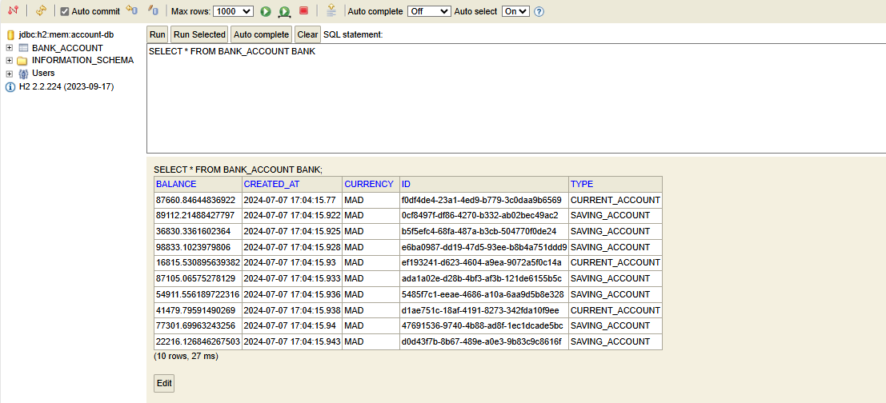
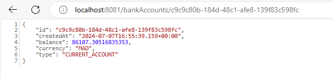
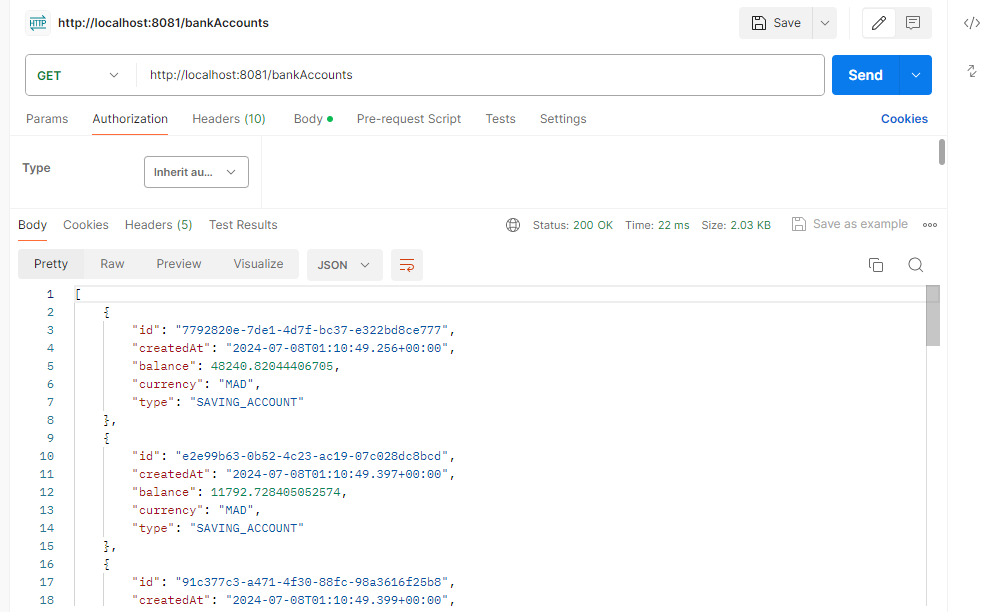
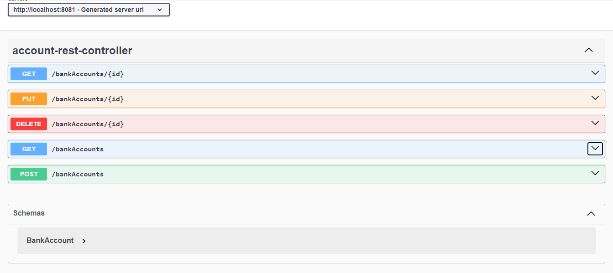

# Micro-service-REST
Ce projet est un micro-service développé avec Spring Boot, utilisant REST comme architecture principale. Il permet la gestion des comptes. La documentation de l'API est générée automatiquement à l'aide de Swagger

## Baase de donnée du web service

## Accounts endpoint

## Account endpoint

## Spring boot REST

## Test du web service sur postman

## Documentation du web service avec swagger

