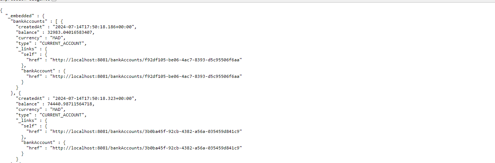

#Web Service pour la gestion de comptze

## Baase de donnée du web service

## Accounts endpoint

## Account endpoint

## Spring boot REST

## Test du web service sur postman

## Documentation du web service avec swagger

